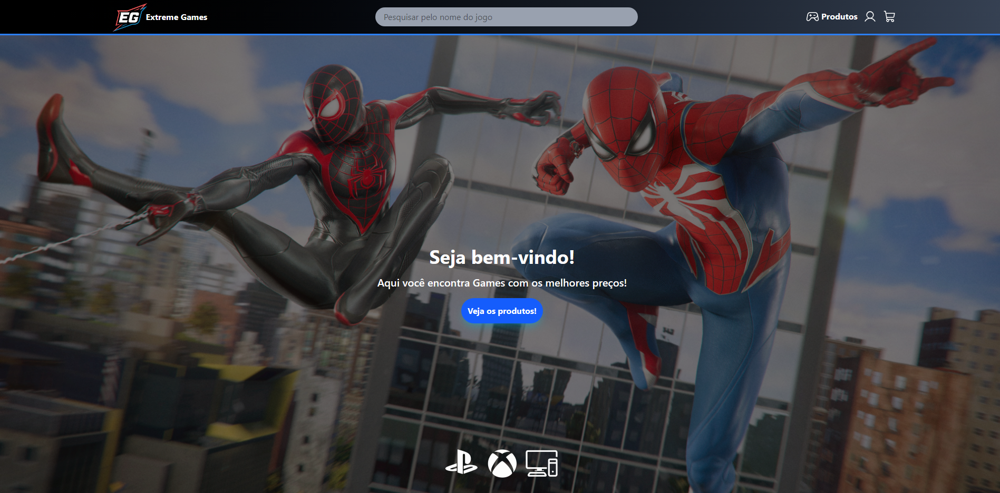

# Loja Online | Extreme Games - React + TypeScript + Vite

Este projeto é uma loja online de games simples desenvolvida em React + TypeScript + Vite, simulando uma experiência de e-commerce. Os produtos são consumidos de uma API REST fake utilizando o JSON Server, e o usuário pode adicionar/remover itens do carrinho e visualizar um resumo antes de finalizar a compra.

## Funcionalidades

- Listagem de produtos (dados vindos da API fake)
- Visualização individual de cada produto
- Carrinho de compras: adicionar, remover, remover tudo, resumo do pedido
- Integração com API REST simulada via JSON Server (`dbTeste.json`)

## Como rodar o projeto


### 1. Clone o repositório

```bash
git clone https://github.com/diego1999dd/tgid-loja-online.git
```

### 2. Instale as dependências

```bash
yarn
```

### 3. Inicie o servidor da API (JSON Server)

```bash
yarn api
```

> Isso irá rodar o JSON Server em `http://localhost:3001` usando o arquivo `dbTeste.json`.

### 4. Em outro terminal, rode o projeto React

```bash
yarn dev
```

### 5. Acesse no navegador

Abra [http://localhost:5173](http://localhost:5173) (ou a porta indicada no terminal).

---
